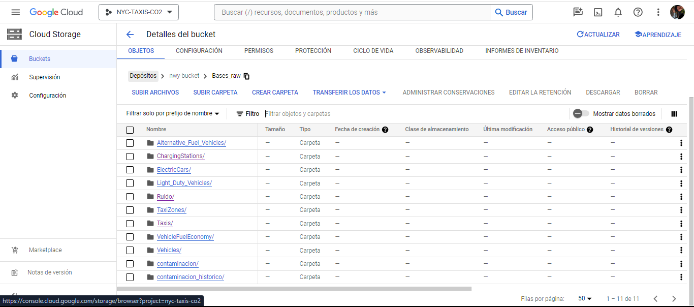
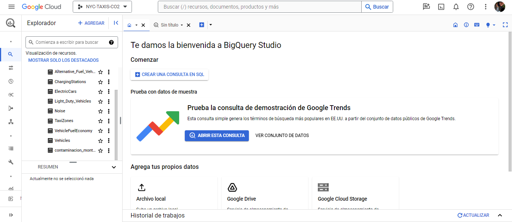

# <h1 align="center">**`NYC Taxis & Carbon Emission`**</h1>
* **`Eduardo Pérez Chavarría` _(Data Engineer, Data Analyst, Data Scientist)_**   
* * **`Alexis Rojas ` _(Data Engineer, Data Analyst)_**   

# Descripción del Proyecto 

## 1. Nosotros
Somos una startup especializada en Business Analytics, comprometida en facilitar el crecimiento de las empresas a través de la toma de decisiones estratégicas. Nuestro enfoque se ha centrado centra en el análisis de datos para proporcionar insights valiosos y soluciones que impulsen el desarrollo y el éxito empresarial. 

Contamos con un equipo interdisciplinario de 3 expertos que, muy a grandez rasgos,  llevarán a cabo las siguientes funciones:

- Data Engineering (Ingeniería de Datos): Encargado de la recopilación, procesamiento y preparación de datos para su disponibilización.
- Data Analysis (Análisis de Datos): Responsable de explorar y analizar los datos para identificar patrones y tendencias.
- Machine Learning Analysis (Análisis de Aprendizaje Automático): Enfocado en aplicar técnicas de aprendizaje automático para modelar y predecir.

Estos roles trabajan en conjunto con el objetivo de garantizar la solidez de los entregables para el cliente

## 2. Contexto del Proyecto
La ciudad de Nueva York, conocida por su intensa actividad y densidad poblacional, presenta un escenario único para estudiar los efectos del transporte urbano en el medio ambiente. Los servicios de taxis y viajes compartidos, como Uber, han revolucionado el modo en que las personas se desplazan por la ciudad. Estos servicios no solo ofrecen conveniencia y accesibilidad sino que también generan valiosos datos en tiempo real, como ubicaciones de vehículos, duración de viajes, tarifas, y calificaciones de conductores. Estos datos son cruciales para identificar patrones de viaje, demanda de servicios y oportunidades de mejora en la eficiencia y calidad del servicio.

En el contexto del cambio climático acelerado y la necesidad creciente de energía más limpia, este proyecto busca analizar cómo los taxis y vehículos de viajes compartidos contribuyen a la problemática ambiental. Nuestro cliente, una empresa de transporte de pasajeros con visión de futuro, está interesada en expandirse al sector de transporte con automóviles, considerando la implementación de vehículos eléctricos para una operación más sostenible.

## 3. Necesidades del Cliente
Su necesidad primordial es conocer la relación entre los servicios de transporte y factores como la calidad del aire y la contaminación sonora. Tambien busca  optimizar sus operaciones y evaluar la viabilidad de incorporar vehículos eléctricos en su flota, alineando sus operaciones con objetivos de sostenibilidad.

## 4. Requerimientos del Proyecto
Para que el cliente obtenga el conocimiento necesario, nosotros:
- Nos esforzamos por obtener un conocimiento profundo de la industria y los desafíos específicos que podría esperar el cliente.
- Garantizaremos el acceso a diferentes tipos de datos con el fin de realizar un análisis exhaustivo.
- Presentamos objetivos clave e indicadores de éxito alineados con las necesidades del cliente.
- Nos adaptamos a las condiciones y restricciones del entorno operativo del cliente.
- Mantendremos comunicación clara y efectiva con el cliente a lo largo del proyecto.

- **Datos Disponibles**: Este trabajo se realiza con una amplia gama de fuentes de datos, incluyendo información de la NYC Taxi and Limousine Commission que facilita indagar sobre la naturaleza de los viajes de taxi de manera historica; datos sobre rendimiento, emisiones de CO2 y de ruido para vehiculos convencionales y eléctricos, datos sobre calidad del aire  y otros relevantes para el análisis.Las bases usadas son tanto estáticas como dinámicas (consultas a APIs y Web Scrapping)

## 5. **Expectativas y Objetivos

* Objetivo principal
Nuestro objetivo principal es evaluar el movimiento de los taxis y servicios de viajes compartidos en la ciudad de Nueva York y realizar predicciones para proporcionar a la empresa de transporte de pasajeros información clave sobre la relación entre estos medios de transporte y la calidad del aire, contaminación sonora, y otros factores relevantes, incluyendo alternativas más rentables a largo plazo. Esto permitirá a la empresa tomar decisiones más acordes con sus objetivos.

## 6. Alcance

### 6.1.  Alcance a nivel de Datos
- **Enfoque en Taxis Amarillos y verdes:** Nuestra principal área de interés recae en los taxis amarillos y los taxis verdes. Estos dos tipos de servicios de transporte representan una parte significativa del tráfico en la ciudad y cuentan con una abundante cantidad de datos disponibles, así como de datos consistentes respecto al tiempo de viaje, ubicación de recogida y distancia recorrida (a diferencia de los autos de alquiler que no proporcionan, de manera consistente, datos sobre distancia, factor crucial para nuestros análisis). En suma, esta elección se basa en su capacidad para proporcionar información detallada sobre los viajes y su impacto ambiental.

### 6.2. Alcance espacial
- **Foco en la Ciudad de Nueva York:** El análisis se limita a la ciudad de Nueva York, fundamentalmente debido a las necesidades del cliente, pero también debido a su densidad de tráfico y disponibilidad de datos detallados. Esta delimitación permite concentrar el estudio en un área urbana con una infraestructura de transporte compleja y variada, proporcionando un caso de estudio representativo para ciudades con características similares.

- **Exclusión de Áreas Fuera de NYC:** No se incluyen datos o análisis de otras ciudades o regiones. Esta decisión se basa en la necesidad de mantener la coherencia y relevancia de los datos dentro del contexto específico de Nueva York.

### 6.3. Alcance Temporal
- **Uso de Datos Hasta la Fecha Más Reciente y desde 2009:** El informe utilizará datos disponibles hasta el momento más actual para garantizar que el análisis refleje las condiciones y tendencias más recientes. Esta delimitación asegura que el informe sea lo más actual y relevante posible.Los datos se restringirán al periodo a partir de 2012 que es el año en que empata la información sobre taxis amarillos y verdes, así como sobre datos historicos sobre el precio de la gasolina en New york. Sin embargo, es necesario señalar que, por motivos de capacidad de computo, presentamos "dos proyectos". Por un lado, un análisis detallado de tendencias para los periodos de 2021 y 20222, y un análisis de prospectiva que abarca de 2012 a 2024.  

- **Proyección de Tendencias Futuras:** Con el fin de pronosticar la influencia sobre el cambio de flota que es esencial para nuestro cliente se presentan datos proyectados hasta enero de 2024. 

#### 6.4. Alcance en torno a supuestos Tecnológicos y Operativos
- **Base en la Tecnología Actual de Vehículos Eléctricos:** El informe se basará en las especificaciones y rendimiento actuales de los vehículos eléctricos, proporcionando un análisis realista de su viabilidad en el presente. Esto se debe a que la inclusión de suposiciones sobre desarrollos futuros podría introducir incertidumbre y especulación en el análisis.

- **Infraestructura de Carga Actual:** Las recomendaciones sobre vehículos eléctricos considerarán la infraestructura de carga existente, para proporcionar sugerencias prácticas y aplicables en el contexto actual.

- **Supuestos:**: Con el fin de ofrecer información sobre el cambio a vehiculos electricos, y ante la falta de información que permita identificar si un taxi es convencional o no, se toma como hecho que los taxis son todos de éste ultimo tipo. 

## 7.  ¿Qué objetivos tenemos con este proyecto y qué entregables daremos al cliente? 

1. **Impacto Ambiental del Transporte de Pasajeros:** Nuestro primer objetivo es analizar el movimiento de taxis y servicios de viajes compartidos en la ciudad de Nueva York para evaluar su impacto ambiental, centrándonos en la relación con la calidad del aire, la contaminación sonora y las emisiones de CO2.

2. **Eficiencia Económica de la Empresa de Transporte:** El segundo objetivo consiste en evaluar el rendimiento económico de la empresa de transporte de pasajeros. Utilizaremos métricas como la duración de los viajes, el porcentaje de tarifas y los costos operativos 

3. **Valor añadido por la implementación de Vehículos Eléctricos en la Flota:** Nuestro tercer objetivo es determinar la viabilidad de incorporar vehículos eléctricos en la flota de la empresa de transporte. Esto se basará en los resultados del análisis ambiental y económico. Proporcionaremos recomendaciones respaldadas por datos para apoyar la toma de decisiones informada en este aspecto. De manera específica, asumiendo que todos los vehiculos son convencionales, el análisis económico se realizará proyectando las emisiones de co2, de ruido y el gasto para los vehiculos convencionales, para luego generar una situación contrafactual que permita identificar las ventajas de un cambio futuro. Esto se logrará por medio de pronosticos con series de tiempo. 

### Entregables
- Nuestro cliente recibirá todo lo necesario para obtener información al día, ya procesada y convertida en conocimiento. Para ello:
   * **Se garantizará la automatización de la carga de las fuentes de información en un servicio en la nube (GCP), además de una estructura de datos que permita disponibilizarlos y mantenerlos actualizados**. No solo se brindará la arquitectura de datos sino también el código y los datos  que lo hacen posible. 
   
   * **Predicciones sobre las ventajas de transitar a autos electricos, vía modelos de Machine Learning**. En este caso, se brindará el código, que, conectándose a la arquitectura antes mencionada, permitirá usar los datos de manera automática para generar el modelo, predictivo  y entregar las predicciones via una api. 

   * **Analisis interactivo sobre los viajes de taxis en New york.** Se trata de un Tablero interactivo en PowerBI que, conectándose a la arquitectura de datos, permitirá obtener información actualizada sobre las dinámicas de movilidad, emisiones de contaminación y ruido generados por los taxis en New York. 

## 8. Metodología general de trabajo: Metodología Scrum 
Para este trabajo operamos bajo la metodología Scrum. Scrum es un marco de trabajo ágil orientado a la gestión y planificación de proyectos, que facilita la colaboración efectiva y la adaptación rápida a cambios. Se basa en ciclos de desarrollo cortos e iterativos, conocidos como Sprints, y enfatiza la importancia de objetivos claros, retroalimentación continua y adaptabilidad.

### Aplicación al Proyecto
La metodología Scrum se adapta al proyecto debido a su naturaleza dinámica y multifacética. Permite al equipo abordar eficientemente tareas complejas de análisis de datos, ingeniería de datos y machine learning, manteniendo un enfoque en la entrega continua de valor y en el desarrollo de habilidades técnicas y blandas.

En el archivo [scrum hitos](scrum_hitos.md)  puede revisarse el detalle de los roles existentes en la metodología, los hitos por sprint y los analistas responsables de ellos. 

Del mismo modo, en [metodologia_especificaciones.md](metodologia_especificaciones.md) puede observarse de manera especifica los analisis que deben realizarse para atender los objetivos del proyecto

## 9. KPIs, cálculo, meta y asociación
Cada KPI se calculará utilizando fórmulas específicas basadas en los datos recopilados y analizados:

1. **Tasa de reducción en emisiones anuales de CO2 al cambiar un 20% la flotilla a vehiculos electricos:**

   Cálculo: ((Emisiones de CO2 en el año base (datos historicos, 1 año antes) - Emisiones de CO2 en el año actual(pronosticado a 12 meses)) / Emisiones de CO2 en el año base (datos historicos, 1 año antes)) * 100

   Meta: Reducción del 10% en las emisiones de CO2 en comparación con el año base.

2. **Tasade reducción del gasto anual del combustible al cambiar un 20% la flotilla a vehiculos electricos:**

   Cálculo: (gasto en combustible anual antes del cambio (datos historicos, 1 año antes) - gasto en combustible anual despues del cambio (pronosticado a 12 meses)) / gasto en combustible anual antes del cambio (datos historicos, 1 año antes) * 100

   Meta: Reducción del 10% en el gasto en combustible

3. **Tasa de disminución del volumen anual de ruido cambiar un 20% la flotilla a vehiculos electricos:**

   Cálculo: (volumen anual de ruido antes del cambio (datos historicos, 1 año antes) - volumen anual de ruido  despues del cambio (datos pronosticados a 12 meses)) / volumen anual de ruido  antes del cambio (datos historicos, 1 año antes) * 100

   Meta: Reducción del 10% en el volumen de ruido

## 10. Tecnologías a usar (cambiar por lo que hizo Alexis)

### Tecnologías para el Proyecto de Análisis de Tráfico y Contaminación en NYC

#### 1. Python
- **Descripción**: Python es un lenguaje de programación interpretado, con fuerte soporte para la integración y la orientación a objetos. Su simplicidad y flexibilidad lo han convertido en una opción preferida para análisis de datos, ciencia de datos y desarrollo de software.
- **Uso en el Proyecto**: Será utilizado para analizar grandes conjuntos de datos de tráfico, calidad del aire y sonora, aprovechando librerías como Pandas para la manipulación y análisis de datos estructurados, y Scikit-learn para el desarrollo de modelos de machine learning. Python nos permitirá procesar y analizar eficientemente los datos, así como desarrollar algoritmos predictivos y de clasificación necesarios para entender las dinámicas del tráfico y su impacto ambiental.

#### 2. Google Cloud BigQuery
- **Descripción**: BigQuery es un servicio de almacén de datos en la nube de Google, que ofrece una ejecución rápida de consultas SQL sobre grandes datasets. Se destaca por su capacidad de manejar petabytes de datos y su modelo de precios basado en el uso.
- **Uso en el Proyecto**: Utilizaremos BigQuery para consolidar y analizar grandes volúmenes de datos de diferentes fuentes. Su capacidad para manejar consultas complejas y grandes conjuntos de datos nos permitirá identificar patrones y tendencias en el tráfico y la contaminación, así como correlacionar estos datos con la calidad del aire y otros factores ambientales.

#### 3. Google Cloud AI Platform
- **Descripción**: Es una suite de servicios y herramientas que facilitan a los desarrolladores y científicos de datos el desarrollo, entrenamiento y despliegue de modelos de machine learning.
- **Uso en el Proyecto**: Emplearemos AI Platform para desarrollar y entrenar modelos de machine learning, aprovechando sus capacidades de procesamiento de alto rendimiento y su integración con herramientas de análisis y almacenamiento de datos. Esto nos permitirá implementar modelos predictivos y analíticos complejos, fundamentales para entender y predecir el impacto del tráfico en la contaminación.

#### 4. Google Sheets
- **Descripción**: Google Sheets es una herramienta de hojas de cálculo en línea que permite la colaboración en tiempo real. Es ampliamente utilizado para el análisis de datos debido a su accesibilidad y funcionalidad de integración.
- **Uso en el Proyecto**: Será utilizado para la recopilación y análisis colaborativo de datos financieros y operativos. Su integración con otras herramientas de Google Cloud facilitará la manipulación y visualización de datos, permitiendo compartir resultados y análisis en tiempo real con el equipo y los stakeholders.

#### 5. Google Cloud Dataflow
- **Descripción**: Dataflow es un servicio totalmente gestionado para procesar datos en tiempo real y por lotes. Ofrece un modelo de programación simplificado para desarrollar aplicaciones de procesamiento de datos y es altamente escalable.
- **Uso en el Proyecto**: Dataflow será utilizado para procesar y transformar datos de múltiples fuentes de manera eficiente, facilitando tareas de ETL y preparación de datos para su análisis posterior. Su capacidad para manejar grandes volúmenes de datos y procesamiento en tiempo real será crucial para mantener actualizados nuestros análisis y dashboards.

#### 6. Google Data Studio
- **Descripción**: Data Studio es una herramienta de visualización de datos que permite convertir los datos en informes interactivos y dashboards. Ofrece conectividad con varias fuentes de datos y permite una fácil interpretación de los datos.
- **Uso en el Proyecto**: Usaremos Data Studio para crear dashboards e informes interactivos que resuman nuestros hallazgos y análisis. Esto facilitará la comunicación de insights complejos a los stakeholders de manera comprensible y atractiva.

#### 7. Google Cloud Datalab
- **Descripción**: Datalab es un entorno interactivo basado en Jupyter que facilita el análisis y la visualización de datos complejos en Google Cloud.
- **Uso en el Proyecto**: Proporcionará un entorno flexible para el análisis exploratorio de datos, visualización y desarrollo de modelos de machine learning. Su integración con otras herramientas de Google Cloud permitirá un flujo de trabajo eficiente y una fácil exploración de los datos.

#### 8. Google Cloud Storage
- **Descripción**: Es un servicio de almacenamiento de objetos en la nube que ofrece durabilidad y escalabilidad. Permite guardar grandes cantidades de datos no estructurados.
- **Uso en el Proyecto**: Cloud Storage será utilizado para almacenar de manera segura y eficiente los grandes volúmenes de datos recopilados durante el proyecto, desde datos brutos hasta resultados procesados y modelos de machine learning.

#### 9. Google Cloud Dataprep
- **Descripción**: Dataprep es una herramienta de servicio inteligente para visualizar, limpiar y preparar datos para el análisis.
- **Uso en el Proyecto**: Facilitará la limpieza y transformación de los datos recopilados, asegurando que sean precisos y estén listos para el análisis. Su interfaz intuitiva y capacidades de automatización simplificarán el proceso de preparación de datos.

#### 10. Google App Engine
- **Descripción**: Es una plataforma como servicio (PaaS) que permite a los desarrolladores crear y desplegar aplicaciones en la infraestructura de Google.
- **Uso en el Proyecto**: Desarrollaremos y desplegaremos aplicaciones web para interactuar con los modelos de datos y presentar los resultados. App Engine nos proporcionará un entorno de hosting escalable y gestionado para estas aplicaciones.

#### 11. Google Kubernetes Engine
- **Descripción**: Es un servicio de orquestación de contenedores para la ejecución de aplicaciones en contenedores en un entorno de cluster.
- **Uso en el Proyecto**: Kubernetes Engine nos permitirá desplegar y escalar aplicaciones y servicios de manera eficiente, gestionando automáticamente la infraestructura subyacente.

#### 12. Google Workspace
- **Descripción**: Conjunto de herramientas de colaboración y productividad en la nube que incluye Gmail, Docs, Drive, Calendars y más.
- **Uso en el Proyecto**: Será utilizado para la colaboración en equipo, la gestión de documentos, presentaciones y hojas de cálculo, facilitando la comunicación y el trabajo coordinado entre los miembros del equipo.

#### 13. Github
- **Descripción**: Es un servicio web de hosting para el control de versiones y la colaboración en proyectos de software.
- **Uso en el Proyecto**: Se empleará para la gestión del código fuente, seguimiento de cambios, colaboración en el desarrollo y documentación del proyecto, garantizando un flujo de trabajo organizado y eficiente en el desarrollo de software y análisis de datos.

Cada una de estas tecnologías ha sido cuidadosamente seleccionada para abordar aspectos específicos del proyecto, desde el análisis y procesamiento de datos hasta la colaboración y presentación de resultados, asegurando un enfoque integral y eficiente para el análisis de tráfico y la contaminación en NYC.

## 12. Cronograma

| Actividad                                       | Lunes | Martes | Miércoles | Jueves | Viernes | Sprints    |
| ---------------------------------------------- | ----- | ------ | --------- | ------ | ------- | ---------- |
| **SEMANA 1**                                   |       |        |           |        |         | **Sprint 1** |
| Entendimiento de la situación actual           |   x   |   x    |    x      |   x    |         |            |
| Definición de objetivos                        |       |        |    x      |        |         | **Sprint 1** |
| Delimitación del alcance                      |       |        |    x      |        |         | **Sprint 1** |
| Desarrollo de KPIs                            |   x   |   x    |    x      |   x    |         |            |
| Creación del repositorio en Github            |       |        |           |   x    |   x     | **Sprint 1** |
| Solución propuesta                            |   x   |   x    |    x      |   x    |         |            |
| Documentación del alcance del proyecto        |   x   |   x    |    x      |   x    |         |            |
| EDA de los datos                              |   x   |   x    |    x      |   x    |         |            |
| Análisis preliminar de calidad de datos       |   x   |   x    |    x      |   x    |         |            |
| **SEMANA 2**                                   |       |        |           |        |         | **Sprint 2** |
| ETL completo                                   |   x   |        |           |        |         |            |
| Estructura de datos implementada (DW, DL, etc.)|   x   |   x    |           |        |         |            |
| Pipeline ETL automatizado                      |   x   |   x    |           |        |         |            |
| Diseño del Modelo ER                           |   x   |   x    |           |        |         |            |
| Análisis de datos de muestra                   |   x   |   x    |           |        |         |            |
| MVP/Prueba de Concepto de Dashboard/Producto ML|   x   |   x    |           |        |         |            |
| Documentación y reporte realizado              |       |   x    |    x      |        |         | **Sprint 2** |
| **SEMANA 3**                                   |       |        |           |        |         | **Sprint 3** |
| Dashboard final                                |   x   |   x    |           |        |         |            |
| Producto/s de ML                               |   x   |   x    |           |        |         |            |
| Diseño de Reportes/Dashboards                  |   x   |   x    |           |        |         |            |
| Modelos de ML en producción                   |       |        |    x      |   x    |         | **Sprint 3** |
| Selección del modelo, feature engineering      |       |        |    x      |   x    |         | **Sprint 3** |
| Informe de análisis                            |       |   x    |           |        |         | **Sprint 3** |
| Preparación de video del proyecto              |       |        |           |   x    |         | **Sprint 3** |

## 13. Resumen de logros obtenidos, soliciones finales y desarrollo de los entregables

### En arquitectura de datos

El proceso de orquestación de datos en la nube consiste en la creación de flujos de trabajo automatizados que permiten el procesamiento, transformación y almacenamiento de datos en la nube. En este caso, se utilizó Google Composer para crear DAGs (Directed Acyclic Graphs) que se ejecutan automáticamente y realizan las siguientes tareas:

- Web Scraping
La primera tarea consiste en realizar web Scraping de distintas fuentes para obtener datos en formato HTML. Para ello, se utilizan las herramientas de Python como Scrapy o Beautiful Soup. Los datos obtenidos se almacenan en archivos Parquet o CSV en Google Storage.

- Almacenamiento de datos
Los archivos Parquet o CSV obtenidos en la etapa anterior se almacenan en Google Storage. Google Storage es un servicio de almacenamiento de objetos en la nube que ofrece una alta escalabilidad y rendimiento.
- Transformación de datos
Los datos almacenados en Google Storage se transforman con las herramientas de Google Cloud, como Cloud Dataproc. Estas herramientas permiten realizar una amplia gama de operaciones de transformación de datos, como limpieza, normalización, agrupación, etc.

- Almacenamiento de datos transformados
Los datos transformados se almacenan en BigQuery, un servicio de análisis de datos en la nube. BigQuery ofrece una alta escalabilidad y rendimiento para el almacenamiento y análisis de grandes volúmenes de datos.

- Visualización de datos
Los datos almacenados en BigQuery se pueden visualizar con el servicio de visualización de datos Power BI. Power BI ofrece una amplia gama de herramientas para la creación de informes y dashboards interactivos.

Paso a paso:
El proceso de orquestación de datos en la nube con Google Composer se puede dividir en los siguientes pasos:

- **Creación de un entorno de Cloud Composer:**
En primer lugar, se debe crear un entorno de Cloud Composer. Un entorno de Cloud Composer es un espacio de trabajo aislado donde se pueden crear y ejecutar DAGs.

- **Creación, Configuración y Publicación de los DAGs:**
Una vez creado el entorno de Cloud Composer, se procede a crear los DAGs, se configuran para especificar las tareas a ejecutar, el orden de ejecución y las condiciones de ejecución. Finalmente se publican. para que puedan ejecutarse automáticamente.

- **Almacenamiento en Google Storage:**
De forma automática, se almacena en un bucket de Google Storage todos los datasets sin transformar.

- **Transformación**
Las transformaciones se realizan con las funciones previamente diseñadas, que también se agregan en la carpeta de DAGs, son parte del flujo de los datos. 

- **Estructura de Tablas:**
Los datos transformados se estructuran en forma de tablas y se almacenan en BigQuery.

- **Exportar tablas:**
Estas tablas de BigQuery se exportan a una herramienta de visualización de datos (Power BI en este caso) para su posterior análisis

- **Airflow** 
Cada una de las tareas se ejecuta de forma automática y periódica según lo requerido.

La orquestación de datos en la nube con Google Composer es una solución eficaz para el procesamiento, transformación y almacenamiento de datos a gran escala. Este proceso permite automatizar las tareas de ingesta, transformación y análisis de datos, lo que mejora la eficiencia y la productividad. Los DAGS y sus funciones asociadas que fueron usados para la carga y el ETL automáticos pueden encontarse [aqui](Sprint-03/Data_flow_management_and_orchestration)

### En Machile Learning

- Se construyó un modelo de pronostico para las emisiones de CO2, de ruido y el gasto por consumo de gasolina generado por los taxis. Para ello la metodología fue la siguiente:

   - A falta de datos específicos, y con miras a evaluar los beneficios de cambiar un porcentaje de la flota a vehiculos eléctricos, se asumió que todos los vehiculos actuales usados como taxis yellow y green son de tipo convencional. Para estimar la producción de CO2 por Borough se utilizó una [base de datos](Sprint-03/ML_models/ML_ElecVsConv_coef/processed_edmunds_data.csv) con la que se obtuvo el valor medio de emisiones de vehiculos convencionales por milla, de esta misma base también se obtuvo la emisión media de sonido. Además de ello, se utilizó también para construir, por medio de una regresión múltiple, un coeficiente de reducción de emisiones de Co2 y de ruido con base en si el coche es o no eléctrico. Del mismo modo, se utilizó para constuir un cociente de ahorro. La libreta que permitió construirlo es [esta](Sprint-03/ML_models/ML_ElecVsConv_coef/analisis_edmunds.ipynb).

   - A partir de lo anterior, y con base en el supuesto señalado, las bases de taxis Yellow y Green fueron integradas y procesadas desde los años 2012 y 2014 respectivamente, para empatar para los datos obtenidos sobre el costo de la gasolina. En ese proceso, se agruparon los datos por 'borough', año y mes para calcular estadísticas clave. Luego, con las medias calculadas señaladas antes, para emisiones de CO2, ruido y rendimiento en millas por galon para vehículos no eléctricos, se calculó el costo mensual del combustible (se usaron los valores promedio mensuales para New York), las emisiones de CO2 y el volumen de ruido en función de la distancia total recorrida y el número total de viajes, el calculo se hizo por volumen total mensual. El proceso puede seguirse en la libreta que contiene el ETL de ambos tipos de taxis ([Yellow aquí](Sprint-03/ML_models/ML_Forecast_Taxis_Co2NoiseSavings/ETL_Yellow.ipynb), [Green aquí](Sprint-03/ML_models/ML_Forecast_Taxis_Co2NoiseSavings/ETL_Green.ipynb)). Los archivos finales de ese proceso fueron usados para entrenar un modelo ARIMA que permitiera pronosticar valores 12 meses en futuro para las variables ya mencionadas, diferenciando por Borough.

   - Las libretas que contienen los modelos son estas: para [Yellow taxis aquí](Sprint-03/ML_models/ML_Forecast_Taxis_Co2NoiseSavings/modelo_Yellowy.ipynb) y para [Green taxis aquí](Sprint-03/ML_models/ML_Forecast_Taxis_Co2NoiseSavings/modelo_green.ipynb). En un principio se pretendía utilizar un modelo arima, debido a que las emisiones a pronosticar provenían de un calculo directo a partir de los datos, sin embargo pudo notarse la existencia de "picos" atribuibles a la pandemia, por lo cual se creó una variable binaria que cuyo valor es 1 en las observaciones que van desde marzo de 2020 hasta mayo de 2023 (fecha en que la OMS dio por terminada la emergencia por COVID-19). Por este motivo al final se realizó un modelo SARIMAX, que se utiliza para integrar variables explicativas como el covid. Se muestra ahora una predicción del modelo para Taxis Yellow   
   
   

   - Predicciones similares se realizaron para el ruido y el ahorro en gasto por combustible. El pronostico fue necesario para poder simular una situación contrafactual, ya que ningúna variable en la base de datos permitía analizar el impacto en emisiones, ruido y ahorro, de cambiar un porcentaje de la flota. Con ello en mente, se utilizaron varias estrategias para simular el ahorro ante un cambio en la flota del 20%. Las cuales se comentan a continuación. 

   #### Reducción de las emisiones de CO2 
   - En este caso, dado un valor pronosticado, se restó de él las emisiones de la cantidad de vehiculos que no van a generar contaminación (es decir, el 20% que ya serán electricos = valor pronosticado* 0.20), dicho valor fue graficado debajo del valor pronosticado. 

   #### Reducción emisiones de ruido
   - Para las emisiones de ruido el calculo no fue tan directo debido a que los coches electricos sí siguen generando valores para esta variable (contrario a CO2 donde el valor se vuelve 0). Por ello a el volumen pronosticado emitido por flota que ya sería electrica (20% del valor predicho) fue multiplicado por el [coeficiente de reducción](Sprint-03/ML_models/ML_ElecVsConv_coef/analisis_edmunds.ipynb), el resultado de ello fue restado al valor pronosticado. 
   

   
   #### Ahorro en gasto de combustible. 
   - En este caso se obtuvo la media del rendimiento por gallon de los vehiculos convencionales y eléctricos, de ello se obtuvo un cociente de reducción. En este caso al valor pronosticado fue restado el producto del cambio porcentual (.20) por el mismo valor pronosticado,  cuyo resultado de fue dividido por cociente de reducción.  
   (P- (.2*P)/cociente)

- Finalmente. El modelo de predicción fue desplegado en Fast-API, por medio de una instancia virtual en Google Cloud. Puede accederse a ella desde "http://34.125.39.205:8000/docs"  (es necesario asegurarse de que el navegador no cambia el protocolo a https, si lo hace la api no va a cargar). Link Directo [aquí](http://34.125.39.205:8000/docs) (aunque se recomienda copiar y pegar la dirección proporcionada en el navegador). El despliegue tiene un End Point para consultar los resultados del modelo para el Pronostico, el ahorro y la diferencia entre estos para emisiones de Co2, emisiones de ruido y ahorro para 12 meses desde el último dato procesado (2023-6). 

- El despliegue maximiza las bondades informativas del modelo, pues permite ajustar el porcentaje de cambio de la flota

- otorga el valor pronosticado, el valor para el cambio dado por el  porcentaje ingresado y la diferencia entre ambos, para cada distrito. 

### C.  En análisis de datos

En nuestro camino como Analista de Datos en el proyecto "NYC Taxis & Carbon Emission", desempeñamos un papel crucial en la extracción, limpieza, análisis y presentación de datos para facilitar la toma de decisiones informadas. El enfoque del proyecto abarcó un extenso análisis de datos de Taxis Amarillos y Taxis Verdes , con especial atención a variables como la ubicación, las tarifas por zona , la contaminacion de ruido y por c02 y la infraestructura de estaciones eléctricas en Nueva York.

## Extracción y Limpieza de Datos:

La primera fase de nuestra responsabilidad consistió en la extracción y limpieza de datos relevantes. Esto implicó la recopilación de información detallada sobre los Taxis Amarillos y Taxis Verdes, abarcando diversos aspectos como las transacciones por zona, tarifas aplicadas y la ubicación geográfica de las estaciones eléctricas.

## Análisis de Datos:

Una vez obtenidos los datos, llevamos a cabo un análisis exhaustivo que incluyó la creación de visualizaciones significativas para identificar patrones, tendencias y relaciones. El análisis se centró en variables clave como el monto de cobro por zona, la distribución geográfica de los taxis y la presencia de estaciones eléctricas en Nueva York.

## Power BI Dashboard:

Para comunicar de manera efectiva los hallazgos, desarrollamos un  dashboard utilizando Power BI. Este dashboard abarcó varias páginas, cada una dedicada a un aspecto específico del análisis:

Taxis Amarillos vs. Taxis Verdes (2022-2023): Presentación de estadísticas generales y comparativas entre ambos tipos de taxis.

Tarifas y Ubicaciones por Zona: Visualización detallada de las tarifas aplicadas y la distribución geográfica de los taxis.

Infraestructura de Estaciones Eléctricas en NY: Mapa interactivo que destaca la ubicación de estaciones eléctricas en Nueva York.

Comparación de Eficiencia de Vehículos: Página dedicada a analizar la eficiencia de vehículos convencionales en comparación con vehículos eléctricos.

Estudio de Contaminación por Ruido: Análisis de la contaminación acústica generada por Taxis Amarillos y Taxis Verdes.

Contaminación por CO2 y Costo Promedio de Gasolina: Página que aborda la contaminación por dióxido de carbono y el promedio de costo por consumo de gasolina en Taxis Verdes y Amarillos.
